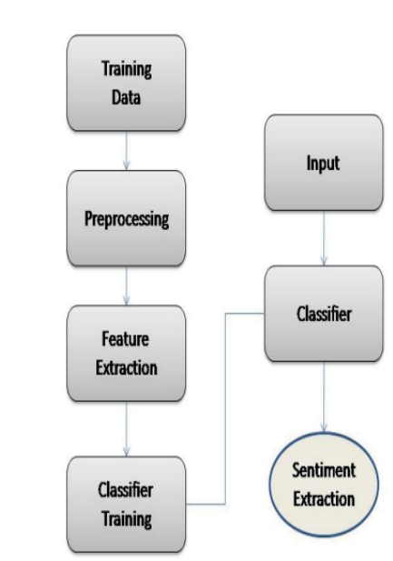

# Implementation of Customer Review Sentiment Analysis over Apache Spark

Sentiment Analysis of large-scale data has become increasingly important and urging researchers to use
new platforms and tools that can handle large volumes of data. In this paper, we present new evaluation
experiments of sentiment analysis for a large-scale dataset of online customer’s reviews under Apache
Spark data Processing System. Apache Spark’s scalable machine learning library (MLlib) is used and
three classification techniques from the library are applied; Naive Bayes, Logistic Regression and Linear
Support Vector Classifier (SVC) model. The results are evaluated using the accuracy metric. Experimental
results show that the Logistic Regression classifier outperforms Naive Bayes and Linear SVC classifiers.

# Proposed System

